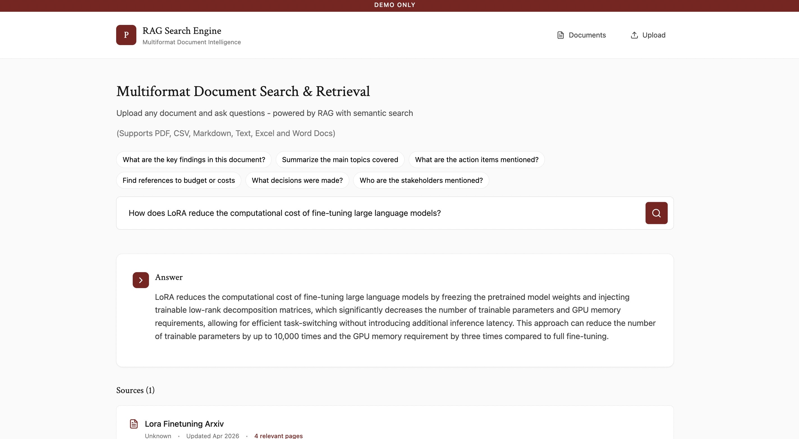
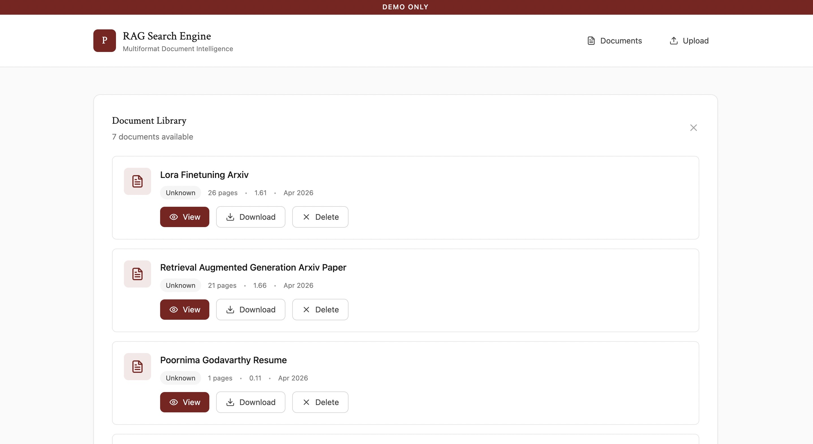
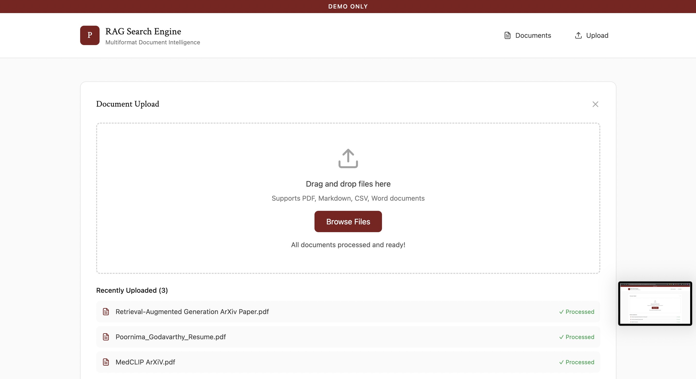

# RAG Multiformat Document Search
*Built and deployed by Poornima Godavarthy*

## Description
A semantic search system that lets you upload documents in any format and ask questions in natural language. Documents are parsed, chunked, and embedded into a vector database. Queries are matched against stored chunks filtered by client, and a grounded answer is generated with source citations and page references.

The system supports PDF, DOCX, PPTX, CSV, XLSX, Markdown, and TXT files, with each format handled by a dedicated parser. An async Redis queue processes uploads in the background so the UI stays responsive.

## Demo

### Semantic search with grounded answers
<p align="center">
  
</p>

### Source citations with page references
<p align="center">
  
</p>

### Document library across multiple formats
<p align="center">
  
</p>

### Async document upload and processing
<p align="center">
  
</p>

---

## Stack

| Layer | Tech |
|---|---|
| Frontend | React, Vite, Tailwind CSS |
| Backend | FastAPI |
| Vector DB | Qdrant |
| Embeddings | OpenAI `text-embedding-3-small` |
| LLM | GPT-4o mini |
| Job queue | Redis |
| Storage | AWS S3 |
| Database | PostgreSQL (SQLAlchemy) |
| Deployment | Vercel (frontend), Fly.io (backend + worker) |

---

## Choose How to Run
1. [Live Demo](#live-demo)
2. [Run Locally](#running-locally)

---

## Running Locally

### Prerequisites
- Python 3.10+
- Node.js 18+
- A running Redis instance ([Upstash](https://upstash.com) works well for free)
- A Qdrant instance ([Qdrant Cloud](https://cloud.qdrant.io) has a free tier)
- PostgreSQL database ([Neon](https://neon.tech) has a free tier)
- OpenAI API key
- AWS S3 bucket

### Instructions

1. **Clone the repository:**
   ```bash
   git clone https://github.com/poornimagodavarthy/RAG-Multiformat-Document-Search.git
   cd RAG-Multiformat-Document-Search
   ```

2. **Set up environment variables:**

   Create a `.env` file in the root directory:
   ```
   OPENAI_API_KEY=your_key
   QDRANT_URL=your_qdrant_url
   VECTORDB_KEY=your_qdrant_api_key
   QDRANT_COLLECTION_NAME=knowledge_base
   DATABASE_URL=your_postgres_url
   REDIS_URL=your_redis_url
   AWS_ACCESS_KEY_ID=your_aws_key
   AWS_SECRET_ACCESS_KEY=your_aws_secret
   S3_BUCKET=your_bucket_name
   S3_REGION=us-east-2
   DB_KEY=your_client_id
   ```

3. **Set up a virtual environment:**
   ```bash
   python3 -m venv venv
   source venv/bin/activate        # macOS/Linux
   .\venv\Scripts\activate         # Windows
   ```

4. **Install backend dependencies:**
   ```bash
   pip install -r requirements.txt
   ```

5. **Start the backend:**
   ```bash
   uvicorn api.server:app
   ```

6. **Start the worker** (separate terminal, same venv):
   ```bash
   python worker.py
   ```

7. **Install and start the frontend:**
   ```bash
   cd frontend
   npm install
   npm run dev
   ```

8. Open `http://localhost:PORT`

---

## Deployment

The app is deployed using:
- **Frontend** → [Vercel](https://vercel.com) (set root directory to `frontend`)
- **Backend + Worker** → [Fly.io](https://fly.io) (Dockerfile included)

For your own deployment, set all environment variables in your Vercel and Fly.io dashboards. The worker needs to run as a separate process alongside the backend on Fly.io.

---

## Architecture
- **Unified markdown conversion**: every format (PDF, DOCX, PPTX, CSV, Excel) gets parsed into markdown or CSV first, so one chunking pipeline handles everything cleanly without format-specific edge cases downstream
- **Heading-aware chunking**: section headings and page numbers are preserved and prepended to each chunk rather than stripped, so retrieval pulls contextually grounded passages instead of orphaned fragments — makes a real difference on structured documents like research papers
- **Qdrant for vector search**: payload filtering lets the system scope searches to a specific client's documents at the vector level, keeping multi-tenant data isolated without extra query logic
- **Redis for async processing**: decouples upload from ingestion so a 30-page PDF chunking in the background never blocks the API response, keeping the UI responsive
- **PostgreSQL for metadata**: stores document titles, page counts, S3 URLs, and client IDs, serving as the source of truth that the vector DB syncs against on startup
